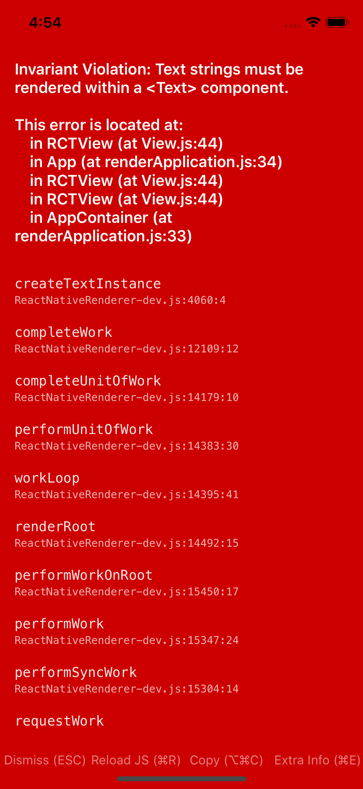

In line comments break react-native 56+, as shown below.
Removing "This comment breaks the app" allows the app to run.
Comments on lines by themselves seem to be ok.



```JSX
export default class App extends Component<Props> {
  render() {
    return (
      <View style={styles.container}>
        {/* This comment is ok */}
        <Text style={styles.welcome}>Welcome to React Native!</Text> {/* This comment breaks the app */}
        <Text style={styles.instructions}>To get started, edit App.js</Text>
        <Text style={styles.instructions}>{instructions}</Text>
      </View>
    );
  }
}
```
